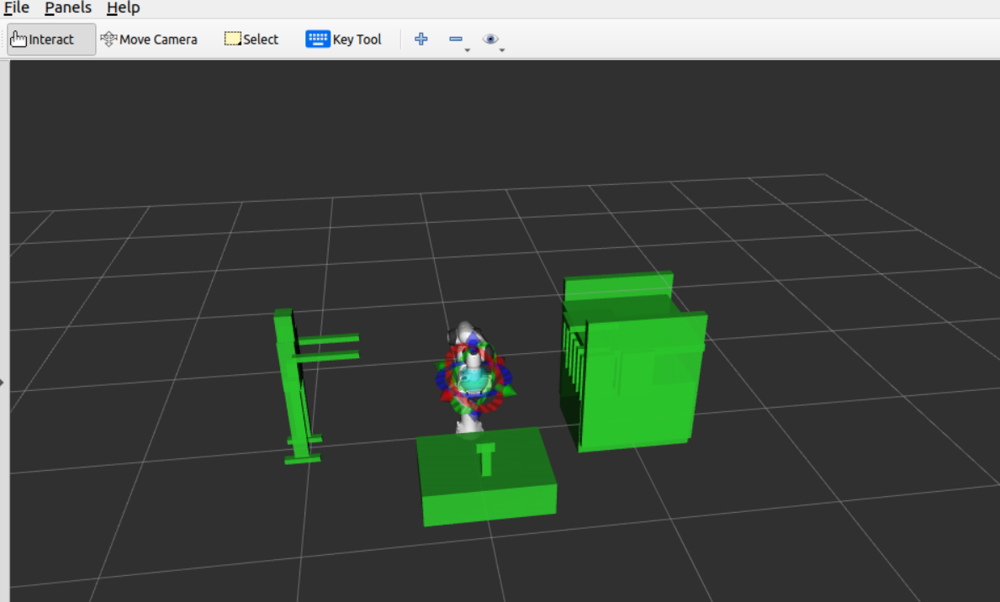

[](https://classroom.github.com/online_ide?assignment_repo_id=16922617&assignment_repo_type=AssignmentRepo)

# Running the Library Aid Project  
**by Hambal Tella**

  
*An illustration of the robot performing pick-and-place operations in a library environment.*

Follow these steps to execute the pick-and-place operation:

1. Start the ROS core:
```bash 
   roscore
```
2. Launch the Panda MoveIt configuration with RViz:
```bash
   roslaunch panda_moveit_config demo.launch rviz_tutorial:=true
```
3. Add and select the the MotionPlanning in Rviz
4. Open the project.py file to pick and place book on the shelve: 
```bash
    rosrun library_aid project.py
```
5. Open the project_human.py file to pick and place book on the shelve as instructed by the human.
```bash
    rosrun library_aid project_human.py
```

